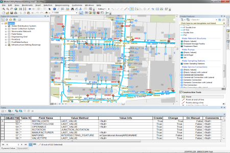

# local-government-desktop-addins

The ArcGIS for Local Government Desktop Add-ins include a series of desktop toolbars that optimize data management workflows. The toolbars are used in ArcGIS for Local Government editing maps like: Water Utility Network Editing, Address Data Management, Water Utility Capital Planning, Special Event Planning, and Pre-Fire Planning.

## Features

* Attribute Assistant
* Water Utility Network Editing
* Water Utility Network Reporting
* Capital Planning
* Address Data Management

## Instructions

### Esri Solutions 

Esri's provides a number of solutions that utilize these toolsets
* [Address Data Management] http://solutions.arcgis.com/local-government/help/address-management/
* [Campus Editing] http://solutions.arcgis.com/local-government/help/campus-editing/
* [Streetlight Inventory] http://solutions.arcgis.com/local-government/help/street-tree-inventory/
* [Street Tree Inventory] http://solutions.arcgis.com/local-government/help/sign-inventory/
* [Signal Inventory] http://solutions.arcgis.com/local-government/help/signal-inventory/
* [Sidewalk Inventory] http://solutions.arcgis.com/local-government/help/sidewalk-inventory/
* [Water Utility Network Editing] http://solutions.arcgis.com/local-government/water-utilities/help/network-editing/

### Additional Help

[Detailed help](http://solutions.arcgis.com/local-government/water-utilities/help/network-editing/tools/)
is provided with each solution on the ArcGIS Solution Site.

### General Help
[New to Github? Get started here.](http://htmlpreview.github.com/?https://github.com/Esri/esri.github.com/blob/master/help/esri-getting-to-know-github.html)

## Requirements

* ArcGIS 10.2 SDK
* .Net 4.0
* Visual Studio 2010 or greater

### Esri Sample Data

* Microsoft ASP.NET Framework 3.5 available from the [Microsoft website](http://www.microsoft.com/en-us/download/details.aspx?id=17851)

### Your Data

* Microsoft ASP.NET Framework 3.5 available from the [Microsoft website](http://www.microsoft.com/en-us/download/details.aspx?id=17851)

## Resources

Learn more about Esri's [ArcGIS for Local Government maps and apps](http://solutions.arcgis.com/local-government/).

Show me a list of other [Local Government GitHub repositories](http://esri.github.io/#Local-Government).

Show me a list of other [Utilities GitHub repositories](http://esri.github.io/#Utilities).

Additional [information and sample data](http://www.arcgis.com/home/item.html?id=385978c927124489b4dc6110eded38df)
are available for the desktop add-ins.

## Issues

Find a bug or want to request a new feature?  Please let us know by submitting an issue.

## Contributing

Esri welcomes contributions from anyone and everyone.
Please see our [guidelines for contributing](https://github.com/esri/contributing).

## Licensing

Copyright 2013 Esri

Licensed under the Apache License, Version 2.0 (the "License");
you may not use this file except in compliance with the License.
You may obtain a copy of the License at

   http://www.apache.org/licenses/LICENSE-2.0

Unless required by applicable law or agreed to in writing, software
distributed under the License is distributed on an "AS IS" BASIS,
WITHOUT WARRANTIES OR CONDITIONS OF ANY KIND, either express or implied.
See the License for the specific language governing permissions and
limitations under the License.

A copy of the license is available in the repository's
[LICENSE.txt](LICENSE.txt) file.

